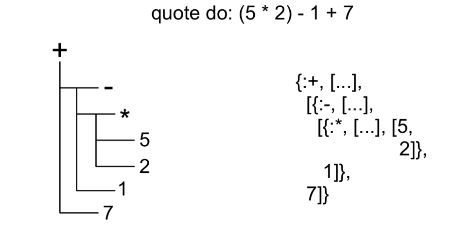
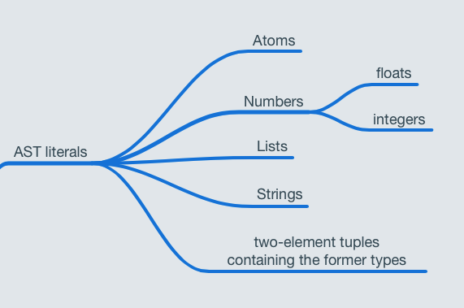
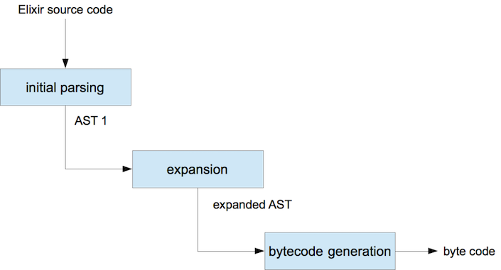

# Macros:

## Metaprogramming Elixir

---
# This topic is too big for 1/2hr

Session goals:
- Reading macro source is less weird
- Know some tools at your disposal

---

# Rule 1: Don't write macros

- Don’t use a macro when some functions on a module will do
  - data > functions > macros
- When taken too far, macros can make programs difficult to debug and reason about

---

# Rule 2: Use Macros Gratuitously

- They are not as complicated as they first appear
- They are helpful for DSLs, removing boiler plate, performance optimisations and more…
- Macros can still be readable code

---

# Elixir is Mostly Written in Elixir

- As [github](https://github.com/elixir-lang/elixir) will show Elixir is currently written in `89.1%` Elixir
- The language is built on a few basic building blocks called [special forms](https://github.com/elixir-lang/elixir/blob/master/lib/elixir/lib/kernel/special_forms.ex). There are surprisingly few of these, the rest of the language is achieved using macros.
- For example `if`, `in`, `def`, `unless` are all just macros that expand to those building blocks

---

# What are macros anyway

- A macro is just code that generates code.
- They receive AST as arguments, and provide AST as the return value.

---

# There are 3 ways to return AST in Elixir
- Hand roll it
- `Macro.escape`
  - Recursively escapes a value so it can be inserted into a syntax tree.
- `quote` (often used in conjunction with `unquote`)
  - Generates the AST for any expression

---

# AST

- Every expression you write in Elixir breaks down to a three-element tuple in the AST (with the exception of a few AST literals)
  1. The atom representing the function call
  2. The context (crucial to hygiene)
  3. The function arguments as a list

As mentioned this is what `quote` can provide you

---

# AST

```elixir
quote do: 1 + 2
{:+, [context: Elixir, import: Kernel], [1, 2]}
```
---



---

# AST Literals

- There are a few literals in Elixir that have the same representation when quoted
- These are atoms, integers, floats, lists, strings, and any two-element tuples containing the former types



---

# AST Literals

```elixir
iex> quote do: [:one, 2, {3.0, "four"}]
[:one, 2, {3.0, "four"}]
```

---

# Creating yep/nope (or rebuilding `if`)

```elixir
defmodule YepNope do
  defmacro yep_nope(condition, do: do_clause) do
    YepNope.yep_nope(condition, do: do_clause, else: nil)
  end

  defmacro yep_nope(condition, do: do_clause, else: else_clause) do
    quote do
      case unquote(condition) do
        x when x in [false, nil] -> unquote(else_clause)
        _ -> unquote(do_clause)
      end
    end
  end
end
```

---

# Creating yep/nope (or rebuilding `if`)

```elixir
defmodule YepNopeTest do
  require YepNope

  def yep_nope(condition) do
    YepNope.yep_nope condition do
      "yep"
    else
      "nope"
    end
  end
end
YepNopeTest.yep_nope(true) # "yep"
YepNopeTest.yep_nope(false) # "nope"
```

---

# Creating yep/nope (or rebuilding `if`)

Notice that we have to `require YepNope` before we use it. This is because macros are expanded during compilation, so we we need to indicate that we are going to use `YepNope`.

_It also has to do with lexical scoping, but that is outside the scope of todays talk_

---

# Macro expansion

Macros get recursively expanded by the compiler. In other words the macro call will be replaced by the AST that it returns.

`Macro.expand` and `Macro.expand_once` can be used simulate this behaviour.

---

# Macro expansion



---

# Context

- Expressions inside `quote` occur in the callers context, expressions outside quote occur in the callers context.
- You can run any code inside of a macro, the main rule is that you need to return AST. A general rule of thumb is to call out to a standard function as soon as possible.

---

# `unquote`

- `unquote` injects AST into AST returned by `quote`
- It can be helpful to think about `quote` and `unquote` as string interpolation
- `Macro.escape` can be used to recursively escapes a value so it can be inserted into a syntax tree
  - This can be used to turn some data into AST that you then `unquote`

---

# Hygeine

Elixir macros are hygenic by default, this means that any binding to any variables in the macro will not effect the callers context.

---

# Hygeine

```elixir
defmodule Hygiene do
  defmacro no_interference do
    quote do: a = 1
  end
end

defmodule HygieneTest do
  def go do
    require Hygiene
    a = 13
    Hygiene.no_interference
    a
  end
end

HygieneTest.go
# => 13
```

---

# Hygeine

This behaviour can be overridden using the `var!` macro. If you use `var!` inside of a quote block it indicates the that the given variable should not be hygienized.

---

# Hygeine

```elixir
defmodule Hygiene do
  defmacro interference do
    quote do: var!(a) = 1
  end
end

defmodule HygieneTest do
  def go do
    require Hygiene
    a = 13
    Hygiene.interference
    a
  end
end

HygieneTest.go
# => 1
```

---

# Helpful bits and bobs :grimacing:

---

# `unquote` fragments

Unquote fragments provide an easy way to generate functions on the fly

```elixir
defmodule FooBar do
  kv = [foo: 1, bar: 2]
  Enum.each(kv, fn {k, v} ->
    def unquote(k)(), do: unquote(v)
  end)
end
```

There is a good [forum answer](https://elixirforum.com/t/using-unquote-outside-of-quote-block/6179/6) that discusses why this works.

---

# Module attributes

- You can set the same attribute multiple times in a module.
- If you access that attribute in a named function in that module, the value you see will be the value in effect when the function is defined.

---

# Module attributes

```elixir
defmodule Example do
  @attr "one"
  def first, do: @attr

  @attr "two"
  def second, do: @attr
end
IO.puts "#{Example.first} #{Example.second}" # => one two
```

---

# Module attributes

These module attributes can accumulate

```elixir
defmodule Example do
  Module.register_attribute __MODULE__,
    :attr,
    accumulate: true, persist: false

  @attr "one"
  @attr "two"
  def attr, do: @attr
end
IO.inspect Example.attr # => ["two", "one"]
```

---

# `use` and the `__using__` macro

The `Kernel.use` macro will call the `__using__` macro of the module passed to `Kernel.use`.

In other words the following module definition:

```elixir
defmodule AssertionTest do
  use ExUnit.Case, async: true

  test "always pass" do
    assert true
  end
end
```

---

# ...is equivilent to:

```elixir
defmodule AssertionTest do
  require ExUnit.Case
  ExUnit.Case.__using__([async: true])

  test "always pass" do
    assert true
  end
end
```

---

# A single expression quotes differently

```elixir
iex> quote do
...>   field :name
...> end
{:field, [], [:name]}

iex> quote do
...>   field :name
...>   field :desc
...> end
{:__block__, [], [{:field, [], [:name]}, {:field, [], [:desc]}]}
```

---

# `Macro.to_string` is your friend

```elixir
iex> macro_as_str = Macro.to_string(quote do
...>   field :name
...>   field :desc
...> end)
iex> IO.puts macro_as_str
(
  field(:name)
  field(:desc)
)
```

---

# `Macro.postwalk` is your friend

In my opinion postwalk makes your life so much easier because it lets you match against the nodes that you care about in the AST.

> Performs a depth-first, post-order traversal of quoted expressions using an accumulator.

This is easier to show than explain, so lets look at some example code in the [scout repo](https://github.com/everydayhero/scout)

---

# More more more

- Quote options, particularly `bind_quoted`
- Compile hooks
- Lexical scoping of `require`, and `alias`
- Custom sigils
- Custom guards

---

# Some macros in Panoramix

- [`mount`](https://github.com/everydayhero/panoramix/blob/ca2e0825ab54ae8568b37306909777a991e419c0/apps/panoramix/lib/router_helper.ex)
- [`coalesce`](https://github.com/everydayhero/panoramix/blob/ca2e0825ab54ae8568b37306909777a991e419c0/apps/panoramix_ecto/lib/query_helper.ex)
- [`timing`](https://github.com/everydayhero/panoramix/blob/ca2e0825ab54ae8568b37306909777a991e419c0/apps/api_helpers/lib/metrics_helper.ex)
- [`success`](https://github.com/everydayhero/panoramix/blob/ca2e0825ab54ae8568b37306909777a991e419c0/apps/payments_client/lib/base.ex)

# Resources

- The metaprogramming Elixir book
- [The minimum knowledge you need to start Metaprogramming in Elixir](https://dockyard.com/blog/2016/08/16/The-minumum-knowledge-you-need-to-start-metaprogramming-in-Elixir)
- [Understanding Elixir Macros](http://theerlangelist.com/article/macros_1)
- [Elixir - Getting Starterd - Quote and unquote](https://elixir-lang.org/getting-started/meta/quote-and-unquote.html)
- [Special Forms](https://hexdocs.pm/elixir/Kernel.SpecialForms.html#quote/2)
- [Using functions in Elixir guard clauses](http://keathley.io/2016/04/09/elixir-guard-clauses.html)
- [Explanation of unquote fragments](https://elixirforum.com/t/using-unquote-outside-of-quote-block/6179/6)
